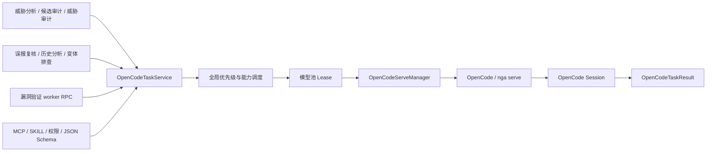

# OpenCode 公共任务与 Session 组件设计及使用指南

本文档说明 OpenDeepHole 内部统一 OpenCode 调用组件的设计、调度规则、Session 生命周期和使用方法。适用于威胁分析、候选点审计、威胁审计、误报复核、漏洞验证及后续新增的所有模型任务。

> 核心约束：所有模型任务只能通过 OpenCode/nga serve 与 OpenCode Session 执行，不再调用 LLM API，也没有 LLM API 降级路径。

## 1. 目标与边界

公共组件需要解决以下问题：

- 所有业务模块使用同一个任务入口，不再各自管理 CLI、模型、重试和结果文件。
- 创建任务后获得稳定的 `task_id`；OpenCode Session 创建后即可获得 `session_id`；任务完成后获得统一结果。
- 支持向已有 Session 追加 prompt，并通过 `session_id` 查询消息、获取最近结果或删除 Session。
- 统一表达模型能力、任务优先级、MCP 工具、SKILL、权限、运行目录、执行超时和 JSON Schema 输出。
- 在全局并发和单模型并发限制下完成能力匹配、优先级调度和模型升级。
- 模型配置变化后重新评估排队任务；排队任务内容变化时保留 `task_id`、递增 `revision` 并重新排队。
- 漏洞验证运行在独立 worker 中，但模型任务仍由 Agent 父进程的公共组件执行。

组件只负责模型任务及其 Session，不负责把业务结果写入漏洞报告、扫描结果或产物文件。业务代码应消费结构化结果并自行完成持久化。

## 2. 总体架构



主要实现文件：

- [`backend/opencode/task_service.py`](../backend/opencode/task_service.py)：公共任务接口、任务状态、Session 管理和结果封装。
- [`backend/opencode/model_pool.py`](../backend/opencode/model_pool.py)：全局队列、能力匹配、优先级和并发调度。
- [`backend/opencode/serve_client.py`](../backend/opencode/serve_client.py)：OpenCode serve 启动、Session API、消息发送和事件流。
- [`backend/opencode/runner.py`](../backend/opencode/runner.py)：旧业务入口的兼容门面，底层仍只调用公共任务组件。
- [`agent/vulnerability_validation.py`](../agent/vulnerability_validation.py)：漏洞验证 worker 到父进程的 OpenCode RPC。

### 2.1 分层职责

| 层 | 负责 | 不负责 |
| --- | --- | --- |
| 业务调用方 | 构造 prompt、选择能力/MCP/SKILL、消费结果 | 直接选具体模型、启动 CLI、维护 Session HTTP 请求 |
| `OpenCodeTaskService` | 任务规范化、排队、Session 生命周期、结构化结果、取消和重排 | 业务结果入库、业务文件写入 |
| `model_pool` | 模型能力匹配、优先级、并发、时间窗口和统计 | OpenCode HTTP/Session 协议 |
| `serve_client` | serve 进程、Session API、消息、原生 JSON Schema、事件流 | 业务调度策略 |

## 3. 为什么使用一个全局队列

实现没有维护三个彼此独立的高/中/低队列，而是使用一个全局待调度队列，并在每个任务上记录最低能力要求。这样可以同时保证：

- 所有任务统一按 `priority` 降序调度，同优先级保持 FIFO。
- 高能力任务等待高能力模型时，不会阻塞后面可以在低能力模型上运行的任务。
- 低能力和中能力任务可以自动升级，不需要在三个队列之间搬移任务。
- 修改任务能力或模型配置时，只需重新评估任务，不需要维护跨队列一致性。

调度器按优先级顺序扫描等待任务，选取第一个“当前存在可用且满足能力要求的模型”的任务运行。它不是只检查队首，因此一个暂时不可运行的高优先级任务不会造成全局队头阻塞。

### 3.1 能力匹配

能力顺序为：

```text
low < medium < high
```

`required_capability` 表示最低能力：

| 任务要求 | 可运行模型 |
| --- | --- |
| `low` | `low`、`medium`、`high` |
| `medium` | `medium`、`high` |
| `high` | 仅 `high` |

公共任务组件启用严格能力约束，并优先选择“最低但足够”的模型。例如低能力任务优先使用低能力模型，低能力模型没有空闲容量时可升级到中或高能力模型；高能力任务不会降级。

同能力层级存在多个可用模型时，调度会综合当前运行数、权重和最近使用时间分配任务。`weight` 越高，在其它条件相近时越优先获得任务。

### 3.2 优先级和并发

- `priority` 范围为 `1..100`，越大越优先，默认 `50`；越界值会被截断到有效范围。
- 全局运行数不能超过 `opencode_concurrency`。
- 单个模型运行数不能超过该模型的 `max_concurrency`。
- 模型配置了 `time_windows` 时，只在 Agent 本地时间的有效窗口中参与调度。
- 空模型池、全部模型被禁用、能力不匹配或模型处于时间窗外时，任务保持排队，等待配置或时间变化，不会回退到 LLM API。
- 任务执行超时从获得模型 Lease 后开始计算，排队时间不计入 `timeout_seconds`。

### 3.3 配置变化和任务变化

默认使用 Agent 当前配置的任务会在排队期间重新读取模型池配置。配置发布后，调度条件会被唤醒并重新评估等待任务。

如果调用方显式传入 `cli_config`，该任务使用传入的配置；需要更换配置时，应调用 `update_queued_task(...)` 重新排队。任务更新规则如下：

- 只有 `queued` 或 `blocked` 状态可以更新。
- 更新后保留原 `task_id`。
- `revision` 加一，排队时间重新计算。
- 运行中的任务不会被隐式停止或重启。
- 已绑定 Session 的任务不能修改为另一个运行目录。

## 4. 任务和 Session 生命周期

```text
submit_task
    -> queued/blocked
    -> 获得模型 Lease
    -> running
    -> 创建新 Session 或向已有 Session 发送消息
    -> success | failure | timeout | cancelled
```

任务与 Session 不是一一对应关系：

- 一个新任务可以创建一个新 Session。
- 多个后续任务可以通过同一个 `session_id` 向该 Session 依次追加消息。
- 每次追加都是独立任务，会重新排队、选择模型并产生独立 `task_id` 和结果。
- 同一 Session 的消息在 Agent 进程内串行执行，避免上下文消息并发写入。
- Session 的 `directory` 首次绑定后不可改变。
- 正常完成不会自动删除 Session；取消或超时时会 abort 当前 Session 请求，但仍不会把整个 Session 历史当作普通清理项删除。

对于新 Session，`handle.wait_session_id()` 会等待任务获得模型并完成 Session 创建；对于传入的已有 `session_id`，该方法可以立即返回传入值。若任务在创建 Session 前失败，最终结果中的 `session_id` 可能为空，因此仍应检查任务结果状态。

Session 本身由 OpenCode 持久化，公共服务中的任务记录、Session 运行参数和锁是 Agent 进程内状态。Agent 重启后，如果要重新管理一个历史 Session，可先用正确的 `directory` 和 `session_id` 追加一条消息，使当前进程重新建立该 Session 的运行参数；不能仅凭一个未登记的 ID 直接调用查询或删除接口。

## 5. 公共数据结构

### 5.1 `OpenCodeTaskSpec`

| 字段 | 类型 | 默认值 | 含义 |
| --- | --- | --- | --- |
| `task_name` | `str` | 必填 | 任务名称，也是新 Session 的标题 |
| `prompt` | `str` | 必填 | 本次发送给 OpenCode 的用户消息 |
| `directory` | `Path` | 必填 | OpenCode API 的真实项目运行目录；Session 续写时必须保持一致 |
| `required_capability` | `str` | `low` | 最低模型能力：`low`、`medium`、`high` |
| `workspace` | `Path \| None` | `directory` | 隔离 OpenCode 配置和查找 SKILL 的工作区；一般由框架设置 |
| `scope_id` | `str` | 空 | 模型池统计范围，扫描任务通常传 `scan_id` |
| `task_context` | `dict` | `{}` | 看板和任务历史的业务元数据，如任务类型、漏洞索引；不要放密钥 |
| `mcp_tools` | `list[str] \| None` | `None` | 本次消息允许使用的 MCP 工具 |
| `skills` | `list[str \| Path]` | `[]` | 本次消息明确加载的 SKILL 名称、目录或 `SKILL.md` 路径 |
| `timeout_seconds` | `int \| None` | 配置值 | 获得模型后的执行超时，必须大于 0 |
| `priority` | `int` | `50` | 任务优先级，范围 `1..100` |
| `output_schema` | `dict \| None` | `None` | OpenCode 原生 JSON Schema 输出约束 |
| `output_retry_count` | `int` | `2` | 原生结构化输出不满足 Schema 时的重试次数 |
| `permissions` | `list[dict] \| None` | `None` | OpenCode Session 权限规则 |
| `session_id` | `str \| None` | `None` | 为空时创建 Session；非空时向已有 Session 追加消息 |
| `writable_paths` | `list[Path]` | `[]` | 构建隔离运行配置时额外允许写入的路径 |
| `cli_config` | 配置对象 | 当前配置 | 显式指定 OpenCode/模型池配置；普通业务一般不传 |
| `global_concurrency` | `int \| None` | 当前配置 | 显式指定全局并发；普通业务一般不传 |
| `attempt` | `int` | `0` | 业务重试次数标记，只用于调用元数据 |
| `on_output` | callback | `None` | 接收 OpenCode 中间输出；不得把它当作最终结果 |
| `on_invocation_metadata` | callback | `None` | 获得模型和调用来源元数据时触发 |
| `cancel_event` | event-like | `None` | 外部取消信号，需要提供 `is_set()` |

`task_name` 和 `prompt` 不能为空。路径会转换为绝对路径。能力值和优先级会在入队前统一规范化。

### 5.2 MCP 工具选择

`mcp_tools` 只控制 MCP 工具，不用于关闭 OpenCode 内建工具：

- `None`：不限制当前 OpenCode 配置中可用的工具。
- `[]`：关闭本次消息的全部 MCP 工具。
- `['view_function_code']`：关闭其它 MCP 工具，只启用匹配的工具。

选择器可以使用工具完整 ID 或可唯一匹配的工具名。存在未知选择器时任务失败，而不是静默忽略。

### 5.3 SKILL 查找

`skills` 中的每一项可以是：

- SKILL 名称，例如 `npd`。
- SKILL 目录绝对路径。
- `SKILL.md` 文件绝对路径。

按名称查找时依次考虑 `workspace` 和 `directory` 下的：

```text
.opencode/skills/<name>/SKILL.md
.agents/skills/<name>/SKILL.md
skills/<name>/SKILL.md
```

选中的 SKILL 内容会作为当前消息的 system prompt 注入，并保留 SKILL 根目录说明，便于解析相对资源。SKILL 不存在时任务失败。Session 续写的每条消息可以选择不同的 SKILL；SKILL 不是 Session 的永久全局开关。

### 5.4 权限

单条权限规则格式为：

```python
{
    "permission": "edit",
    "pattern": "*",
    "action": "deny",  # allow | deny | ask
}
```

新 Session 创建时，`permissions` 会写入 Session；续写已有 Session 且再次传入 `permissions` 时，会更新该 Session 的权限。传 `None` 表示本次不主动修改 Session 权限。

权限是安全边界，不应只依赖 prompt 中的“不要修改文件”。只读审计任务应显式拒绝不需要的写权限，并通过 `mcp_tools` 缩小工具暴露面。

### 5.5 原生结构化输出

传入 `output_schema` 后，组件使用 OpenCode message 的原生 `json_schema` format，不要求模型调用额外的结果提交工具。成功结果位于 `result.structured`。

推荐使用封闭 Schema：

```python
RESULT_SCHEMA = {
    "type": "object",
    "properties": {
        "verdict": {"type": "string", "enum": ["vulnerable", "safe", "unknown"]},
        "reason": {"type": "string"},
    },
    "required": ["verdict", "reason"],
    "additionalProperties": False,
}
```

当指定了 Schema 但 OpenCode 最终没有返回原生结构化数据时，任务状态为 `failure`。此时不要再从 Markdown 或代码块中猜测 JSON。

### 5.6 `OpenCodeTaskResult`

| 字段 | 含义 |
| --- | --- |
| `task_id` | 公共组件生成的稳定任务 ID |
| `session_id` | OpenCode Session ID |
| `message_id` | 当前 assistant message ID |
| `status` | `success`、`failure`、`timeout` 或 `cancelled` |
| `text` | 文本结果；结构化输出存在时为其 JSON 文本形式 |
| `structured` | 原生 JSON Schema 结果，没有 Schema 时通常为 `None` |
| `model` | 实际响应模型 |
| `output_source` | 工具、模型池行、能力、任务和 Session 等调用来源元数据 |
| `error` | 失败原因 |
| `queued_at` / `started_at` / `finished_at` | 排队、开始和结束时间 |
| `duration_seconds` | 获得模型后到结束的执行耗时 |
| `revision` | 当前任务修订号 |

`handle.result()` 和 `service.run_task()` 返回结果对象，不会自动把所有失败状态转换成异常。需要异常式处理时调用：

```python
result = (await handle.result()).raise_for_status()
```

异常映射为：

- `timeout` -> `asyncio.TimeoutError`
- `cancelled` -> `asyncio.CancelledError`
- `failure` -> `OpenCodeTaskError`，异常的 `result` 字段保留完整结果

## 6. 后端异步调用指南

### 6.1 提交任务并尽早获取 Session ID

```python
from pathlib import Path

from backend.opencode.task_service import (
    OpenCodeTaskSpec,
    get_opencode_task_service,
)


async def audit_candidate(project_path: Path):
    service = get_opencode_task_service()
    handle = service.submit_task(OpenCodeTaskSpec(
        task_name="candidate audit: CWE-476",
        prompt="审计指定候选点并给出结论。",
        directory=project_path,
        required_capability="medium",
        scope_id="scan-123",
        task_context={
            "task_type": "candidate_audit",
            "candidate_index": 7,
        },
        mcp_tools=["view_function_code"],
        skills=["npd"],
        timeout_seconds=1200,
        priority=70,
        permissions=[
            {"permission": "edit", "pattern": "*", "action": "deny"},
        ],
    ))

    # 新 Session 在真正创建后返回；任务此时可能仍在运行。
    session_id = await handle.wait_session_id()
    result = (await handle.result()).raise_for_status()
    return session_id, result.text
```

如果不需要提前获得 `session_id`，可以直接使用 `run_task()`：

```python
result = await service.run_task(spec)
result.raise_for_status()
```

### 6.2 获取结构化结果

```python
schema = {
    "type": "object",
    "properties": {
        "is_vulnerable": {"type": "boolean"},
        "reason": {"type": "string"},
    },
    "required": ["is_vulnerable", "reason"],
    "additionalProperties": False,
}

result = await service.run_task(OpenCodeTaskSpec(
    task_name="threat audit",
    prompt="验证威胁路径是否可达，并按 Schema 返回。",
    directory=project_path,
    required_capability="high",
    priority=85,
    output_schema=schema,
    output_retry_count=2,
))
result.raise_for_status()

is_vulnerable = result.structured["is_vulnerable"]
reason = result.structured["reason"]
```

### 6.3 续写已有 Session

```python
first = await service.run_task(OpenCodeTaskSpec(
    task_name="threat model",
    prompt="建立威胁模型。",
    directory=project_path,
    required_capability="high",
))
first.raise_for_status()

follow_up = await service.run_task(OpenCodeTaskSpec(
    task_name="threat model follow-up",
    prompt="继续检查第二条攻击路径。",
    directory=project_path,           # 必须与首次调用一致
    session_id=first.session_id,
    required_capability="medium",    # 每条消息可重新声明能力
    mcp_tools=["view_function_code"],
    priority=80,
))
follow_up.raise_for_status()
```

传入 `session_id` 只表示复用对话上下文，不表示绕过调度。续写任务仍会获得新的 `task_id`，并重新参与能力、优先级和并发调度。

### 6.4 修改排队任务并重新调度

```python
handle = service.submit_task(OpenCodeTaskSpec(
    task_name="background review",
    prompt="执行低优先级复核。",
    directory=project_path,
    required_capability="low",
    priority=20,
))

updated = await service.update_queued_task(
    handle.task_id,
    task_name="urgent review",
    prompt="任务内容已变化，按新要求复核。",
    required_capability="high",
    priority=95,
)

assert updated.task_id == handle.task_id
assert updated.revision == 2
result = (await updated.result()).raise_for_status()
```

调用更新接口时任务可能已开始运行，因此调用方必须处理 `RuntimeError`。运行中任务需要显式取消后创建新任务，不能用更新接口隐式替换。

### 6.5 查询、取消和删除

```python
# 根据 task_id 重新取得进程内 handle
handle = service.get_task(task_id)

# 取消排队或运行中的任务
await handle.cancel()

# Session 查询
session = await service.get_session(session_id)
messages = await service.get_session_messages(session_id)
latest = await service.get_session_result(session_id)

# 删除空闲 Session
await service.delete_session(session_id)

# 如 Session 正在执行，必须明确要求先取消再删除
await service.delete_session(session_id, force=True)
```

`get_session_result()` 返回最近一条 assistant message 的结果视图，不等价于原任务完整的排队时间、耗时和 `output_source`；需要完整任务元数据时，应保留原 `OpenCodeTaskResult`。

## 7. 漏洞验证脚本调用指南

漏洞验证函数是同步函数，并运行在可终止的 worker 进程中。验证脚本必须调用 `ctx.run_opencode_task(...)`，不能用 `ctx.run_command(...)` 或 `subprocess` 启动 `nga`、`opencode`、`hac`、`claude`。直接启动这些 AI CLI 会返回退出码 `126`。

```python
from pathlib import Path


def validate_product(ctx):
    schema = {
        "type": "object",
        "properties": {
            "content": {"type": "string"},
        },
        "required": ["content"],
        "additionalProperties": False,
    }

    first = ctx.run_opencode_task(
        task_name="PoC 设计",
        prompt="读取漏洞信息并设计验证步骤，只返回结构化结果。",
        required_capability="high",
        directory=ctx.project_path,
        mcp_tools=["view_function_code"],
        skills=["validation-poc"],
        timeout_seconds=1200,
        priority=80,
        output_schema=schema,
        permissions=[
            {"permission": "edit", "pattern": "*", "action": "deny"},
        ],
    )

    second = ctx.run_opencode_task(
        task_name="PoC 复核",
        prompt="基于上一阶段继续复核验证步骤。",
        required_capability="high",
        directory=ctx.project_path,
        session_id=first["session_id"],
        output_schema=schema,
        priority=80,
    )

    content = second["structured"]["content"]
    # 文件由 Python 写入，模型只负责返回数据。
    artifact_path = Path(ctx.work_dir) / "poc-review.md"
    artifact_path.write_text(content, encoding="utf-8")
    ctx.publish_artifact("poc-review.md", path=artifact_path, title="PoC", kind="artifact")
```

验证 RPC 返回字典字段：

```text
task_id, session_id, message_id, status,
text, structured, model, output_source
```

父进程会完成以下工作：

- 把验证任务放入与扫描任务相同的全局模型队列。
- 使用当前 Agent OpenCode 配置和全局并发限制。
- 按需启动/复用共享 deephole-code MCP 网关。
- 为当前扫描注册 `project_id`，并在需要 MCP 时把它补充到 prompt。
- 从验证工作区或项目目录解析指定 SKILL。
- 把 worker 的取消信号传递到公共任务组件。

OpenCode 内部流式输出只写入 Agent 控制台。需要在漏洞验证页面显示的内容，验证脚本必须显式调用 `ctx.emit_stdout(...)`；需要展示文件时使用 `ctx.publish_artifact(...)`。

## 8. 模型池配置示例

模型必须在 `opencode.models` 中显式添加并启用。顶层 `opencode.model` 是兼容字段，不参与公共组件的模型池调度。

```yaml
opencode:
  tool: "nga"                   # nga 或 opencode，均通过 serve API
  executable: "nga"
  timeout: 1200
  max_retries: 2
  config_paths: []
  models:
    - id: "fast-low"
      model: "provider/fast-model"
      capability: "low"
      weight: 3
      max_concurrency: 2
      enabled: true
      time_windows: []

    - id: "reasoning-high"
      model: "provider/reasoning-model"
      capability: "high"
      weight: 1
      max_concurrency: 1
      enabled: true
      time_windows:
        - start: "09:00"
          end: "23:00"

    - id: "cli-default"
      model: ""
      use_default_model: true
      capability: "medium"
      weight: 1
      max_concurrency: 1
      enabled: true

opencode_concurrency: 4
```

`use_default_model: true` 表示该行参与调度，但发送消息时不显式指定模型，使用 CLI/OpenCode 配置中的默认模型。即使需要默认模型，也必须显式配置这样一行；空 `models` 不表示自动使用默认模型。

## 9. 新业务接入规范

新增模型任务时遵循以下规则：

1. 后端异步代码直接使用 `OpenCodeTaskService`；已有旧调用点可以暂时经过 `_invoke_opencode` 兼容门面，但不得新增对 `serve_client.run_prompt()` 的业务直调。
2. 漏洞验证脚本只使用 `ctx.run_opencode_task(...)`。
3. 不得新增 OpenAI/其它 LLM API 客户端、API 模式分支或 API 降级逻辑。
4. 不得通过 `subprocess`、`run_command` 或 shell 启动 AI CLI 绕过队列。
5. 需要稳定机器消费的结果必须使用 `output_schema`，不要依赖 Markdown 中的 JSON 代码块。
6. 模型只返回内容，业务 Python 代码负责文件写入、数据库更新和产物发布。
7. `task_context` 应包含可用于看板识别任务的业务字段，但不要放 token、密码或其它秘密；公共组件会自动补充任务名、prompt、优先级和 revision。
8. 使用同一 `session_id` 前确认任务属于同一项目和同一安全上下文，避免跨扫描、跨漏洞复用对话历史。
9. `directory` 使用真实项目根目录；隔离配置目录应通过 `workspace` 交给框架管理，不要复制源码来改变 OpenCode 上下文。
10. 给任务配置最小 MCP 和权限集合，并为取消、超时和失败状态提供明确的业务处理。

## 10. 常见问题与排障

### 任务一直排队

检查模型看板中的 `blocked_reason`，常见原因包括：

- `models` 为空或所有模型未启用。
- 没有满足 `required_capability` 的模型。
- 满足能力的模型不在当前时间窗口。
- 全局或单模型并发已满。
- 更高优先级的可运行任务正在等待容量。

排队不触发 `timeout_seconds`。如果业务有“最长等待时间”，应由业务层对 handle 等待过程单独施加超时并在超时后调用 `handle.cancel()`。

### `OpenCode SKILL not found`

确认 SKILL 存在于 `workspace`/`directory` 的标准目录中，或者传入有效的绝对目录/`SKILL.md` 路径。SKILL 名称不是任意标签，组件会读取实际文件。

### `Unknown OpenCode MCP tool selector`

传入的工具选择器没有匹配当前 OpenCode 配置发现的 MCP 工具 ID。检查共享 MCP 是否已注册、工具名称是否正确，并避免把内建工具名称放进 `mcp_tools`。

### `continuation directory cannot change`

同一个 Session 已绑定另一个项目目录。继续使用最初的 `directory`，或者创建新 Session；不要用同一个 Session 跨项目工作。

### `session runtime is unknown in this Agent process`

当前 Agent 进程没有该 Session 的运行配置，通常发生在 Agent 重启后直接查询历史 Session。用正确的 `session_id` 和原 `directory` 先提交一次续写任务，或通过 OpenCode 自身的 Session 管理命令查看历史。

### `OpenCode response did not contain native structured output`

任务指定了 `output_schema`，但服务端没有返回 `structured`。检查 OpenCode/nga 版本是否支持原生 JSON Schema、Schema 本身是否合法，以及模型是否在重试次数内满足约束。业务层不应在此错误后退回文本猜测。

### 无法更新任务

`update_queued_task()` 只允许更新仍处于 `queued`/`blocked` 的任务。如果任务已经 `running`，应根据业务需求让它完成，或显式取消后创建新任务。

## 11. 建议验证命令

修改公共组件、调度或 Session 行为后，至少运行：

```bash
PYTHONPATH=. python3 -m pytest -q \
  tests/test_opencode_task_service.py \
  tests/test_opencode_model_pool.py \
  tests/test_opencode_serve_client.py \
  tests/test_vulnerability_validation.py
```

如果修改了模型看板或 Agent 配置页面，再运行：

```bash
cd frontend
npm run build
```
