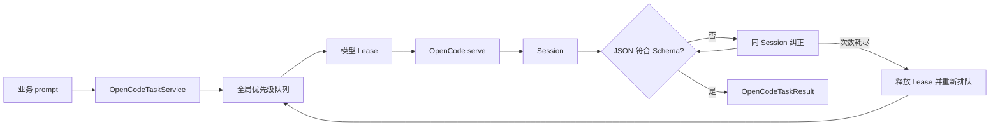

# OpenCode 公共任务与 Session 使用指南

OpenDeepHole 的威胁分析、候选点审计、误报复核、Git 历史分析、变体排查和漏洞验证统一通过 `OpenCodeTaskService` 执行。业务代码不直接启动 CLI、不选择具体模型，也不自行维护 OpenCode Session。

> 所有模型任务只使用 OpenCode/nga serve 与 OpenCode Session；没有 LLM API 降级路径。

## 1. 运行模型



主要实现：

- `backend/opencode/task_service.py`：公共任务接口、自动上下文、权限、双层重试和 Session 管理。
- `backend/opencode/model_pool.py`：全局队列、能力匹配、并发、优先级和统计。
- `backend/opencode/serve_client.py`：serve 进程、Session API、消息与事件流。
- `backend/opencode/config.py`：Agent 全局 OpenCode workspace 和全量 SKILL 注册。
- `agent/vulnerability_validation.py`：验证 worker 到 Agent 父进程的同步 RPC 门面。

所有任务共享一个固定 workspace：

```text
~/.opendeephole/opencode_workspace
```

该目录只保存稳定的 `opencode.json`、共享 MCP 网关配置和全局 SKILL 注册。扫描、误报复核和漏洞验证不再创建自己的 `opencode_workspace`，也不再把运行配置复制到被扫项目中。既有旧目录不会被自动删除。

OpenDeepHole 自带的 checker、误报复核、Git 历史、变体排查和威胁分析 SKILL 都注册在全局 skill root；OpenCode 按任务 prompt 中的名称自行发现并按需加载，不会把所有 `SKILL.md` 正文同时注入 system prompt。项目自身的标准 SKILL 目录仍由 OpenCode 正常发现。

## 2. `OpenCodeTaskSpec`

`get_opencode_task_service().run_task()` 只接收一个 `OpenCodeTaskSpec`：

| 字段 | 类型 | 默认值 | 含义 |
| --- | --- | --- | --- |
| `task_name` | `str` | 必填 | 逻辑任务名，也是新 Session 标题 |
| `prompt` | `str` | 必填 | 本次用户消息 |
| `directory` | `Path` | 必填 | OpenCode 请求的真实代码目录；续写 Session 时不能改变 |
| `required_capability` | `str` | `low` | 最低能力：`low`、`medium`、`high` |
| `timeout_seconds` | `int \| None` | 当前配置 | 每一条模型消息的执行超时；排队时间不计入 |
| `priority` | `int` | `50` | 全局队列优先级，规范到 `1..100` |
| `output_schema` | `dict \| None` | `None` | 要求最终普通文本 JSON 匹配的 JSON Schema |
| `output_retry_count` | `int` | `2` | 每个 Session 内 JSON 不合规后的追加纠正次数 |
| `session_id` | `str \| None` | `None` | 为空时创建 Session；非空时续写已有 Session |
| `writable_paths` | `list[Path]` | `[]` | 除当前扫描工作目录外额外允许文件工具写入的路径 |
| `attempt` | `int \| None` | `None` | 新 Session 重试次数；详见“双层重试” |
| `on_output` | callback | `None` | OpenCode 中间输出回调 |
| `on_invocation_metadata` | callback | `None` | 每次获得新模型 Lease 时收到一次实际调用来源 |
| `cancel_event` | event-like | `None` | 外部取消信号，需提供 `is_set()` |

以下内容由 Agent 自动决定，不再是 TaskSpec 参数：

- `workspace`：始终使用全局 workspace。
- `scope_id`：扫描入口自动绑定当前 `scan_id`；非扫描任务为空。
- `task_context`：扫描、验证和各业务门面自动生成。
- `mcp_tools`：默认启用当前全局配置中的全部工具。
- `skills`：全量注册，OpenCode 按 prompt 自行加载。
- `permissions`：根据 `directory`、当前扫描目录和 `writable_paths` 计算。
- `cli_config`：使用 Agent 当前全局配置；误报复核配置由任务类型在内部选择。
- `global_concurrency`：始终使用 Agent 的 `opencode_concurrency`，任务不能覆盖。

`task_name` 和 `prompt` 不能为空；所有路径会规范为绝对路径。`output_retry_count` 和显式 `attempt` 不能为负数。

## 3. 自动扫描上下文

扫描编排入口一次绑定：

```python
token = set_opencode_execution_context(
    scan_id=scan_id,
    scan_work_dir=Path.home() / ".opendeephole" / "scans" / scan_id,
    feedback_entries=selected_feedback,
)
try:
    await run_scan_tasks()
finally:
    reset_opencode_execution_context(token)
```

随后在这个 async 执行树中提交的任务自动获得：

- 模型池统计范围 `scan_id`；
- 当前扫描目录的写权限；
- 任务类型、checker、文件、函数、漏洞索引等内部看板元数据；
- 当前用户选择的反馈经验。

反馈按 checker 在每次任务提交时生成额外 system 内容，不再写入共享 `SKILL.md`。在线修改反馈会更新后续提交任务的快照，不会污染其它扫描。

普通业务调用方和 validator 作者不应直接设置这些内部字段。

## 4. 默认权限

每次创建或续写 Session 都会由服务端覆盖本次 Session 权限：

- `directory` 下通过 `read`、`list`、`glob`、`grep` 读取。
- `~/.opendeephole/scans/<scan_id>` 下允许文件编辑工具写入。
- `writable_paths` 中的路径继续允许文件编辑工具写入。
- `directory` 本身默认不授予 `edit`。
- `skill` 允许，以便从全局 root 按需加载 SKILL。
- MCP 工具不做任务级筛选，默认全部可用。
- `bash` 按产品约定保持完全允许。

权限规则先写通配拒绝，再写具体路径允许；OpenCode 使用最后一个匹配规则。详见 [OpenCode Permissions](https://opencode.ai/docs/permissions/)。

注意：`directory` 的“只读”约束作用于 OpenCode 文件编辑工具。因为 `bash` 被明确设为完全允许，模型仍可以通过 shell 命令写入 `directory`；它不是 OS 级只读沙箱。

非扫描任务没有默认扫描写目录，只能通过 `writable_paths` 增加文件工具写权限。

## 5. 双层重试

### 5.1 同 Session JSON 纠正

仅当传入 `output_schema` 时启用。

初始回复无法在本地提取出符合 Schema 的 JSON 后，服务会在原 Session 上追加一条纠正消息，重复 Schema 并要求只输出 JSON。默认最多追加 `output_retry_count=2` 次：

```text
初始消息
  -> JSON 无效
  -> 同 Session 纠正 1
  -> JSON 无效
  -> 同 Session 纠正 2
```

这些消息：

- 复用相同 Session、相同模型和同一个 Lease；
- 不重新排队；
- 每条消息分别应用 `timeout_seconds`；
- 不使用 OpenCode 原生 `format=json_schema`，仍解析普通 assistant 文本。

任意一次返回符合 Schema 的 JSON，任务立即成功，值同时保存在 `result.structured`，原始文本保存在 `result.text`。

### 5.2 新 Session 重试

`attempt` 表示“重试次数”，不是当前尝试序号：

- `attempt=0`：只运行一个 Session。
- `attempt=2`：初始 Session 加最多 2 个全新 Session，共最多 3 次。
- `attempt=None`：读取当前任务配置的 `max_retries`，默认配置为 2。

以下情况会触发新 Session 重试：

- 同 Session 的 JSON 纠正次数耗尽；
- 非超时的普通执行异常。

新 Session 重试会：

1. 释放当前模型 Lease；
2. 保留同一个逻辑 `task_id`；
3. 用递增的 `session_attempt`/`retry_ordinal` 重新进入全局队列；
4. 重新选择满足能力要求的模型；
5. 创建全新的 OpenCode Session。

`timeout`、取消和“没有可用模型”是终止状态，不使用新 Session 重试。

中间 Session 尝试会计入模型调用总数和耗时，但不会向扫描的 completed-task 历史追加终态；只有最终成功或失败记录一次逻辑任务完成。`OutputSource.attempt` 是实际的 1-based Session 尝试序号。

若所有 Session 都失败：

- 任务状态为 `failure`；
- `text` 和 `session_id` 保留最后一次回复/Session；
- `structured` 为 `None`；
- `error` 说明最后的执行错误或 JSON 纠正耗尽。

## 6. 基本调用

```python
from pathlib import Path

from backend.opencode.task_service import (
    OpenCodeTaskSpec,
    get_opencode_task_service,
)

RESULT_SCHEMA = {
    "type": "object",
    "properties": {
        "verdict": {"type": "string", "enum": ["vulnerable", "safe"]},
        "reason": {"type": "string"},
    },
    "required": ["verdict", "reason"],
    "additionalProperties": False,
}


async def audit(project_path: Path):
    service = get_opencode_task_service()
    result = await service.run_task(OpenCodeTaskSpec(
        task_name="candidate audit",
        prompt="使用 `npd` 技能审计指定候选点，最终只输出要求的 JSON。",
        directory=project_path,
        required_capability="medium",
        timeout_seconds=1200,
        priority=70,
        output_schema=RESULT_SCHEMA,
        output_retry_count=2,
        attempt=None,
    ))
    return result.raise_for_status().structured
```

若需要在任务仍运行时尽早获得 Session ID：

```python
handle = service.submit_task(spec)
first_session_id = await handle.wait_session_id()
result = (await handle.result()).raise_for_status()
final_session_id = result.session_id
```

发生新 Session 重试时，`wait_session_id()` 可能已经返回第一个 Session；最终权威 ID 始终是 `result.session_id`。

## 7. Session 续写和管理

```python
continued = await service.run_task(OpenCodeTaskSpec(
    task_name="candidate follow-up",
    prompt="基于已有上下文补充证据并重新输出 JSON。",
    directory=project_path,
    session_id=result.session_id,
    output_schema=RESULT_SCHEMA,
))
```

- 同一 Session 的消息在 Agent 进程内串行执行。
- Session 首次绑定的 `directory` 不能改变。
- 正常完成不会自动删除 Session。
- `get_session()`、`get_session_messages()`、`get_session_result()` 和 `delete_session()` 依赖当前 Agent 进程已知的 Session runtime。
- `delete_session(force=True)` 会先取消使用该 Session 的当前任务。

## 8. 任务结果和异常

`OpenCodeTaskResult` 的主要字段：

| 字段 | 含义 |
| --- | --- |
| `task_id` | 跨新 Session 重试保持不变的逻辑任务 ID |
| `session_id` | 最终 Session ID |
| `message_id` | 最终 assistant message ID |
| `status` | `success`、`failure`、`timeout`、`cancelled` |
| `text` | 最终普通文本回复；失败时尽量保留最后文本 |
| `structured` | 符合 `output_schema` 的本地解析结果 |
| `model` | 最终实际响应模型 |
| `output_source` | 模型池、能力、尝试序号和 Session 等来源信息 |
| `error` | 终止原因 |
| `duration_seconds` | 所有 Session 尝试的实际执行耗时之和，不含排队 |
| `revision` | 排队任务修订号 |

`run_task()` 和 `handle.result()` 返回结果对象。需要异常式处理时调用：

```python
result = (await handle.result()).raise_for_status()
```

- `timeout` -> `asyncio.TimeoutError`
- `cancelled` -> `asyncio.CancelledError`
- `failure` -> `OpenCodeTaskError`，其 `result` 保留完整结果

## 9. 排队任务更新

`update_queued_task(task_id, ...)` 只允许更新 `queued` 或 `blocked` 任务：

- 保留 `task_id`；
- `revision` 加一；
- 使用新内容重新排队；
- 已绑定 Session 时仍不能改变 `directory`。

全局并发始终来自 `opencode_concurrency`；模型能力、单模型 `max_concurrency`、权重和时间窗由模型池统一处理，单任务不能覆盖全局并发。

## 10. 漏洞验证 worker

validator 子进程使用同步接口：

```python
result = ctx.run_opencode_task(
    task_name="validation poc analysis",
    prompt="使用 `validation-poc` 技能分析报告并只输出 JSON。",
    required_capability="high",
    directory=ctx.project_path,
    timeout_seconds=ctx.timeout_seconds,
    priority=80,
    output_schema=RESULT_SCHEMA,
    output_retry_count=2,
    attempt=2,
    session_id=None,
    writable_paths=[],
)
```

validator 不传 MCP、SKILL 或权限列表。父进程自动绑定当前 `scan_id`、注册共享 MCP 网关、补充 `project_id`，并由统一任务服务执行。`attempt` 与后端接口含义相同：它是新 Session 重试次数。

验证页面的 `intermediate_output` 仍只接收显式 `ctx.emit_stdout(...)` 和 `ctx.run_command(...)` 输出；OpenCode 内部流只打印到 Agent 控制台。

## 11. 新业务接入检查

1. 所有模型调用必须进入 `OpenCodeTaskService`。
2. 使用真实代码根目录作为 `directory`。
3. 不创建或传递自己的 OpenCode workspace。
4. 不传 scope、task context、MCP、SKILL、权限、CLI 配置或全局并发。
5. 在 prompt 中明确点名要使用的 SKILL。
6. 结构化任务提供封闭 JSON Schema，并让服务统一处理 JSON 纠正。
7. 不在业务层再包一层模型重试循环；通过 `attempt` 控制新 Session 重试。
8. 业务层负责最终入库和文件持久化。
9. 需要额外文件工具写权限时只增加最小 `writable_paths`。
10. 超时和取消按终止状态处理，不假设会自动重试。
